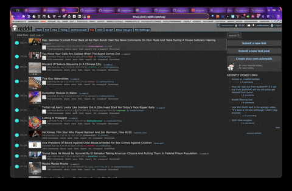
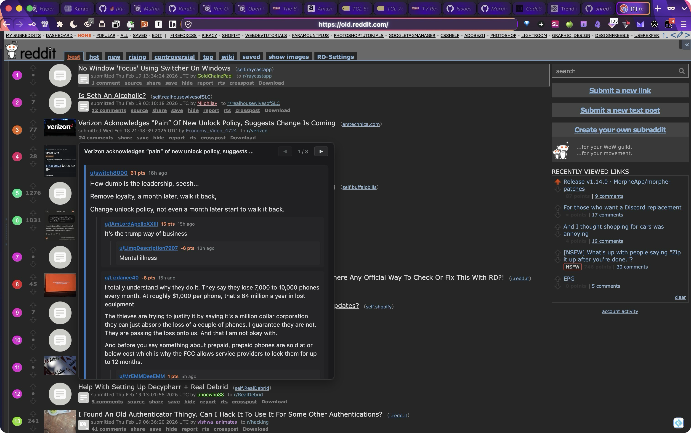
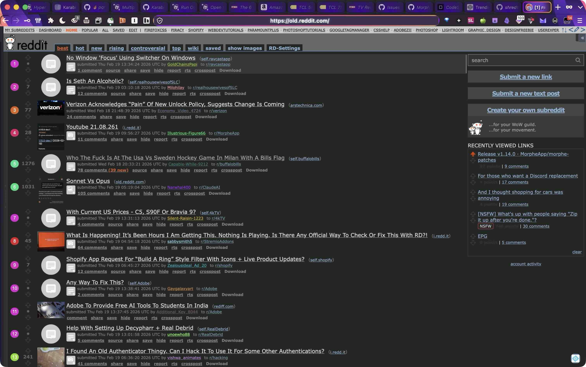

# View Reddit Comments on Hover 
### (no clicking needed)
---

Read Reddit Comments without clicking and opening thread pages. View comments posted inside a chat thread on any Reddit Homepage, SubReddit, Search Results page or any page with Reddit threads and comments! Just hover your mouse over the **COMMENTS** text at the bottom of any thread and a window will automatically popup showing the comments from the thread. Use the forward and back navigation arrows to navigate through as much of the comments as you want.

#### What is it?
- A simple and easy to install userscript to use on ANY instance or version of Reddit, new, open source alternative url and especially Old Reddit (https://old.redddit.com)
#### What Does it Do?
- Allows you to view comments without having to click and go to the threads page. Check out some of the comments and see if its a chat thread you want open and go to. 
- Stay on homescreen and read comments without having to go back and forth from comments pages back to homepage. Also works on any subreddit homepage and search result pages: Anywhere there are threads with comments, you can use this to preview them. 
- Now you can simply choose to preview or view all comments by hovering the mouse over the comments text(link) located in the menu below all of threads text
- Easy to find and use
- Compatible with any version of Reddit or reddit open source clone url.

### ***Check* *It* *Out!***

